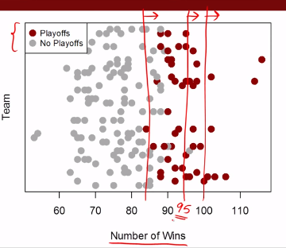

Introdução a Data Analytics com o R
========================================================
author: Pedro Nascimento de Lima e Dieter Brackman Goldmeyer
date: 18/08/2017
autosize: true

Sobre nós..
========================================================
- GMAP | UNISINOS: Grupo de Pesquisa em Modelagem para Aprendizagem.
- Alguém que já conhece o R?

O que Veremos neste Mini-Curso?
========================================================
- O que é Data Analytics?
- Exemplo Moneyball.
- *Como continuar aprendendo.*

O que é Data Analytics?
========================================================
- Novo nome mais bonito para "Estatística";
- Business Analytics;
- Outros termos (Big Data, Machine Learning, Data Science podem ser um pouco imprecisos);

Porque usar o R ?
========================================================
- Open Source e Gratuito;
- Mais de 10 k bibliotecas gratuitas;
- Suporta muitos tipos de Análises;
- Conhecimento "cumulativo" e transferível a outros contextos.

Outras alternativas se você não quiser programar.
========================================================
- Excel(?);
- Alteryx;
- Microsoft Azure;
- Tableu para Análises visuais mais simples;


Que tipo de pessoa usa o R?
========================================================
- R Developer: "Um desenvolvedor R usa suas habilidades de programamação para manipular dados e construir ferramentas para para análise de Dados."
- Data Scientist: "Um cientista de dados combina técnicas estatísticas e de machine learning com programação em R para analisar e interpretar dados complexos".
- Data Analyst: Um Data Analyst traduz números em português claro. Um analista de dados interpreta dados das empresas e o usa para tomar melhores decisões.
- Analista Quantitativo: Na área financeira, uma analista quantitativo garante que portfolios de investimento estão balenceados e encontra novas oportunidades de trading, e avalia preços de ativos usando modelos matemáticos.
Fonte: http://datacamp.com

Exemplo - MoneyBall
========================================================
Este exemplo usa dados relacionados ao filme "Moneyball" para apresentar a técnica de regressão linear com o R.
Este exercício e a ideia de usar o exemplo do Moneyball é baseda em uma aula do MIT, da plataforma Edx: https://courses.edx.org/courses/course-v1:MITx+15.071x_3+1T2016/

Moneyball e o Oakland A's
========================================================
- Moneyball é o livro que conta a história sobre como o Data Analytics mudou a indústria do baseball;
- Oakland A's: Um dos times mais pobres do baseball. Foi vendido e teve seu orçamento cortado;
- Em 2002 o time perdeu três jogadores principais (é desse ponto que o filme começa);

Qual é o problema dos Times Pequenos?
========================================================
- Moneyball é o livro que conta a história sobre como o Data Analytics mudou a indústria do baseball;
- (Imagem Salários vs Vitórias)

Qual é a meta de um time de Baseball?
========================================================
- Ir para as Playoffs!
- Quantos jogos um time precisa ganhar para chegar às playoffs?
- Paul DePodesta calculou que um time precisa de 95 vitórias para chegar às Playoffs.

***



Como se vence 95 jogos?
========================================================
- Fazendo mais "Runs" do que o oponente.
- Quantos "Runs" a mais?
- Eles calcularam que precisariam fazer 135 Runs a mais do receberam para ganhar 95 jogos. Como calcular isso?

Lendo Dados em CSV com read.csv()
========================================================
Normalmente lemos dados no formato .csv no R para realizar as análises. É possível também ler dados em outros formatos.


```r
# Definindo o Working Directory (pasta base na qual estaremos trabalhando).
setwd("D:/dev/sigepro-intro-R/moneyball")
# Lendo Dados em CSV
baseball <- read.csv("baseball.csv")
```


Conhecendo os Dados com str()
========================================================
Antes de rodar qualquer análise precisamos conhecer a estrutura dos dados.
Os dados contém uma linha para cada time e ano de 1962 a 2012 para todas as temporadas.
Dados incluem Runs Scored (RS), Runs Allowed (RA) e Vitórias (W).

```r
# Podemos fazer isso usando a função str() (que mostra a estrutura)
str(baseball)
```

```
'data.frame':	1232 obs. of  15 variables:
 $ Team        : Factor w/ 39 levels "ANA","ARI","ATL",..: 2 3 4 5 7 8 9 10 11 12 ...
 $ League      : Factor w/ 2 levels "AL","NL": 2 2 1 1 2 1 2 1 2 1 ...
 $ Year        : int  2012 2012 2012 2012 2012 2012 2012 2012 2012 2012 ...
 $ RS          : int  734 700 712 734 613 748 669 667 758 726 ...
 $ RA          : int  688 600 705 806 759 676 588 845 890 670 ...
 $ W           : int  81 94 93 69 61 85 97 68 64 88 ...
 $ OBP         : num  0.328 0.32 0.311 0.315 0.302 0.318 0.315 0.324 0.33 0.335 ...
 $ SLG         : num  0.418 0.389 0.417 0.415 0.378 0.422 0.411 0.381 0.436 0.422 ...
 $ BA          : num  0.259 0.247 0.247 0.26 0.24 0.255 0.251 0.251 0.274 0.268 ...
 $ Playoffs    : int  0 1 1 0 0 0 1 0 0 1 ...
 $ RankSeason  : int  NA 4 5 NA NA NA 2 NA NA 6 ...
 $ RankPlayoffs: int  NA 5 4 NA NA NA 4 NA NA 2 ...
 $ G           : int  162 162 162 162 162 162 162 162 162 162 ...
 $ OOBP        : num  0.317 0.306 0.315 0.331 0.335 0.319 0.305 0.336 0.357 0.314 ...
 $ OSLG        : num  0.415 0.378 0.403 0.428 0.424 0.405 0.39 0.43 0.47 0.402 ...
```

Resumindo com o summary()
========================================================
Também podemos ter uma ideia dos dados usando o summary. Ele nos retorna médias, quartis, valores mínimos e máximos.


```r
summary(baseball)
```

```
      Team     League        Year            RS               RA        
 BAL    : 47   AL:616   Min.   :1962   Min.   : 463.0   Min.   : 472.0  
 BOS    : 47   NL:616   1st Qu.:1977   1st Qu.: 652.0   1st Qu.: 649.8  
 CHC    : 47            Median :1989   Median : 711.0   Median : 709.0  
 CHW    : 47            Mean   :1989   Mean   : 715.1   Mean   : 715.1  
 CIN    : 47            3rd Qu.:2002   3rd Qu.: 775.0   3rd Qu.: 774.2  
 CLE    : 47            Max.   :2012   Max.   :1009.0   Max.   :1103.0  
 (Other):950                                                            
       W              OBP              SLG               BA        
 Min.   : 40.0   Min.   :0.2770   Min.   :0.3010   Min.   :0.2140  
 1st Qu.: 73.0   1st Qu.:0.3170   1st Qu.:0.3750   1st Qu.:0.2510  
 Median : 81.0   Median :0.3260   Median :0.3960   Median :0.2600  
 Mean   : 80.9   Mean   :0.3263   Mean   :0.3973   Mean   :0.2593  
 3rd Qu.: 89.0   3rd Qu.:0.3370   3rd Qu.:0.4210   3rd Qu.:0.2680  
 Max.   :116.0   Max.   :0.3730   Max.   :0.4910   Max.   :0.2940  
                                                                   
    Playoffs        RankSeason     RankPlayoffs         G        
 Min.   :0.0000   Min.   :1.000   Min.   :1.000   Min.   :158.0  
 1st Qu.:0.0000   1st Qu.:2.000   1st Qu.:2.000   1st Qu.:162.0  
 Median :0.0000   Median :3.000   Median :3.000   Median :162.0  
 Mean   :0.1981   Mean   :3.123   Mean   :2.717   Mean   :161.9  
 3rd Qu.:0.0000   3rd Qu.:4.000   3rd Qu.:4.000   3rd Qu.:162.0  
 Max.   :1.0000   Max.   :8.000   Max.   :5.000   Max.   :165.0  
                  NA's   :988     NA's   :988                    
      OOBP             OSLG       
 Min.   :0.2940   Min.   :0.3460  
 1st Qu.:0.3210   1st Qu.:0.4010  
 Median :0.3310   Median :0.4190  
 Mean   :0.3323   Mean   :0.4197  
 3rd Qu.:0.3430   3rd Qu.:0.4380  
 Max.   :0.3840   Max.   :0.4990  
 NA's   :812      NA's   :812     
```

Acessando variáveis específicas de um DataFrame
========================================================
Podemos acessar variáveis específicas de um Data Frame usando algumas notações possíveis.


```r
baseball$Year
```

```
   [1] 2012 2012 2012 2012 2012 2012 2012 2012 2012 2012 2012 2012 2012
  [14] 2012 2012 2012 2012 2012 2012 2012 2012 2012 2012 2012 2012 2012
  [27] 2012 2012 2012 2012 2011 2011 2011 2011 2011 2011 2011 2011 2011
  [40] 2011 2011 2011 2011 2011 2011 2011 2011 2011 2011 2011 2011 2011
  [53] 2011 2011 2011 2011 2011 2011 2011 2011 2010 2010 2010 2010 2010
  [66] 2010 2010 2010 2010 2010 2010 2010 2010 2010 2010 2010 2010 2010
  [79] 2010 2010 2010 2010 2010 2010 2010 2010 2010 2010 2010 2010 2009
  [92] 2009 2009 2009 2009 2009 2009 2009 2009 2009 2009 2009 2009 2009
 [105] 2009 2009 2009 2009 2009 2009 2009 2009 2009 2009 2009 2009 2009
 [118] 2009 2009 2009 2008 2008 2008 2008 2008 2008 2008 2008 2008 2008
 [131] 2008 2008 2008 2008 2008 2008 2008 2008 2008 2008 2008 2008 2008
 [144] 2008 2008 2008 2008 2008 2008 2008 2007 2007 2007 2007 2007 2007
 [157] 2007 2007 2007 2007 2007 2007 2007 2007 2007 2007 2007 2007 2007
 [170] 2007 2007 2007 2007 2007 2007 2007 2007 2007 2007 2007 2006 2006
 [183] 2006 2006 2006 2006 2006 2006 2006 2006 2006 2006 2006 2006 2006
 [196] 2006 2006 2006 2006 2006 2006 2006 2006 2006 2006 2006 2006 2006
 [209] 2006 2006 2005 2005 2005 2005 2005 2005 2005 2005 2005 2005 2005
 [222] 2005 2005 2005 2005 2005 2005 2005 2005 2005 2005 2005 2005 2005
 [235] 2005 2005 2005 2005 2005 2005 2004 2004 2004 2004 2004 2004 2004
 [248] 2004 2004 2004 2004 2004 2004 2004 2004 2004 2004 2004 2004 2004
 [261] 2004 2004 2004 2004 2004 2004 2004 2004 2004 2004 2003 2003 2003
 [274] 2003 2003 2003 2003 2003 2003 2003 2003 2003 2003 2003 2003 2003
 [287] 2003 2003 2003 2003 2003 2003 2003 2003 2003 2003 2003 2003 2003
 [300] 2003 2002 2002 2002 2002 2002 2002 2002 2002 2002 2002 2002 2002
 [313] 2002 2002 2002 2002 2002 2002 2002 2002 2002 2002 2002 2002 2002
 [326] 2002 2002 2002 2002 2002 2001 2001 2001 2001 2001 2001 2001 2001
 [339] 2001 2001 2001 2001 2001 2001 2001 2001 2001 2001 2001 2001 2001
 [352] 2001 2001 2001 2001 2001 2001 2001 2001 2001 2000 2000 2000 2000
 [365] 2000 2000 2000 2000 2000 2000 2000 2000 2000 2000 2000 2000 2000
 [378] 2000 2000 2000 2000 2000 2000 2000 2000 2000 2000 2000 2000 2000
 [391] 1999 1999 1999 1999 1999 1999 1999 1999 1999 1999 1999 1999 1999
 [404] 1999 1999 1999 1999 1999 1999 1999 1999 1999 1999 1999 1999 1999
 [417] 1999 1999 1999 1999 1998 1998 1998 1998 1998 1998 1998 1998 1998
 [430] 1998 1998 1998 1998 1998 1998 1998 1998 1998 1998 1998 1998 1998
 [443] 1998 1998 1998 1998 1998 1998 1998 1998 1997 1997 1997 1997 1997
 [456] 1997 1997 1997 1997 1997 1997 1997 1997 1997 1997 1997 1997 1997
 [469] 1997 1997 1997 1997 1997 1997 1997 1997 1997 1997 1996 1996 1996
 [482] 1996 1996 1996 1996 1996 1996 1996 1996 1996 1996 1996 1996 1996
 [495] 1996 1996 1996 1996 1996 1996 1996 1996 1996 1996 1996 1996 1993
 [508] 1993 1993 1993 1993 1993 1993 1993 1993 1993 1993 1993 1993 1993
 [521] 1993 1993 1993 1993 1993 1993 1993 1993 1993 1993 1993 1993 1993
 [534] 1993 1992 1992 1992 1992 1992 1992 1992 1992 1992 1992 1992 1992
 [547] 1992 1992 1992 1992 1992 1992 1992 1992 1992 1992 1992 1992 1992
 [560] 1992 1991 1991 1991 1991 1991 1991 1991 1991 1991 1991 1991 1991
 [573] 1991 1991 1991 1991 1991 1991 1991 1991 1991 1991 1991 1991 1991
 [586] 1991 1990 1990 1990 1990 1990 1990 1990 1990 1990 1990 1990 1990
 [599] 1990 1990 1990 1990 1990 1990 1990 1990 1990 1990 1990 1990 1990
 [612] 1990 1989 1989 1989 1989 1989 1989 1989 1989 1989 1989 1989 1989
 [625] 1989 1989 1989 1989 1989 1989 1989 1989 1989 1989 1989 1989 1989
 [638] 1989 1988 1988 1988 1988 1988 1988 1988 1988 1988 1988 1988 1988
 [651] 1988 1988 1988 1988 1988 1988 1988 1988 1988 1988 1988 1988 1988
 [664] 1988 1987 1987 1987 1987 1987 1987 1987 1987 1987 1987 1987 1987
 [677] 1987 1987 1987 1987 1987 1987 1987 1987 1987 1987 1987 1987 1987
 [690] 1987 1986 1986 1986 1986 1986 1986 1986 1986 1986 1986 1986 1986
 [703] 1986 1986 1986 1986 1986 1986 1986 1986 1986 1986 1986 1986 1986
 [716] 1986 1985 1985 1985 1985 1985 1985 1985 1985 1985 1985 1985 1985
 [729] 1985 1985 1985 1985 1985 1985 1985 1985 1985 1985 1985 1985 1985
 [742] 1985 1984 1984 1984 1984 1984 1984 1984 1984 1984 1984 1984 1984
 [755] 1984 1984 1984 1984 1984 1984 1984 1984 1984 1984 1984 1984 1984
 [768] 1984 1983 1983 1983 1983 1983 1983 1983 1983 1983 1983 1983 1983
 [781] 1983 1983 1983 1983 1983 1983 1983 1983 1983 1983 1983 1983 1983
 [794] 1983 1982 1982 1982 1982 1982 1982 1982 1982 1982 1982 1982 1982
 [807] 1982 1982 1982 1982 1982 1982 1982 1982 1982 1982 1982 1982 1982
 [820] 1982 1980 1980 1980 1980 1980 1980 1980 1980 1980 1980 1980 1980
 [833] 1980 1980 1980 1980 1980 1980 1980 1980 1980 1980 1980 1980 1980
 [846] 1980 1979 1979 1979 1979 1979 1979 1979 1979 1979 1979 1979 1979
 [859] 1979 1979 1979 1979 1979 1979 1979 1979 1979 1979 1979 1979 1979
 [872] 1979 1978 1978 1978 1978 1978 1978 1978 1978 1978 1978 1978 1978
 [885] 1978 1978 1978 1978 1978 1978 1978 1978 1978 1978 1978 1978 1978
 [898] 1978 1977 1977 1977 1977 1977 1977 1977 1977 1977 1977 1977 1977
 [911] 1977 1977 1977 1977 1977 1977 1977 1977 1977 1977 1977 1977 1977
 [924] 1977 1976 1976 1976 1976 1976 1976 1976 1976 1976 1976 1976 1976
 [937] 1976 1976 1976 1976 1976 1976 1976 1976 1976 1976 1976 1976 1975
 [950] 1975 1975 1975 1975 1975 1975 1975 1975 1975 1975 1975 1975 1975
 [963] 1975 1975 1975 1975 1975 1975 1975 1975 1975 1975 1974 1974 1974
 [976] 1974 1974 1974 1974 1974 1974 1974 1974 1974 1974 1974 1974 1974
 [989] 1974 1974 1974 1974 1974 1974 1974 1974 1973 1973 1973 1973 1973
[1002] 1973 1973 1973 1973 1973 1973 1973 1973 1973 1973 1973 1973 1973
[1015] 1973 1973 1973 1973 1973 1973 1971 1971 1971 1971 1971 1971 1971
[1028] 1971 1971 1971 1971 1971 1971 1971 1971 1971 1971 1971 1971 1971
[1041] 1971 1971 1971 1971 1970 1970 1970 1970 1970 1970 1970 1970 1970
[1054] 1970 1970 1970 1970 1970 1970 1970 1970 1970 1970 1970 1970 1970
[1067] 1970 1970 1969 1969 1969 1969 1969 1969 1969 1969 1969 1969 1969
[1080] 1969 1969 1969 1969 1969 1969 1969 1969 1969 1969 1969 1969 1969
[1093] 1968 1968 1968 1968 1968 1968 1968 1968 1968 1968 1968 1968 1968
[1106] 1968 1968 1968 1968 1968 1968 1968 1967 1967 1967 1967 1967 1967
[1119] 1967 1967 1967 1967 1967 1967 1967 1967 1967 1967 1967 1967 1967
[1132] 1967 1966 1966 1966 1966 1966 1966 1966 1966 1966 1966 1966 1966
[1145] 1966 1966 1966 1966 1966 1966 1966 1966 1965 1965 1965 1965 1965
[1158] 1965 1965 1965 1965 1965 1965 1965 1965 1965 1965 1965 1965 1965
[1171] 1965 1965 1964 1964 1964 1964 1964 1964 1964 1964 1964 1964 1964
[1184] 1964 1964 1964 1964 1964 1964 1964 1964 1964 1963 1963 1963 1963
[1197] 1963 1963 1963 1963 1963 1963 1963 1963 1963 1963 1963 1963 1963
[1210] 1963 1963 1963 1962 1962 1962 1962 1962 1962 1962 1962 1962 1962
[1223] 1962 1962 1962 1962 1962 1962 1962 1962 1962 1962
```

Selecionando Linhas Específicas do DF
========================================================
Vamos selecionar apenas dados até o ano de 2002 (que foram os dados que eles possuíam em 2002)


```r
# Considerando apenas anos exibidos pelo moneyball
moneyball = subset(baseball, Year < 2002)
str(moneyball)
```

```
'data.frame':	902 obs. of  15 variables:
 $ Team        : Factor w/ 39 levels "ANA","ARI","ATL",..: 1 2 3 4 5 7 8 9 10 11 ...
 $ League      : Factor w/ 2 levels "AL","NL": 1 2 2 1 1 2 1 2 1 2 ...
 $ Year        : int  2001 2001 2001 2001 2001 2001 2001 2001 2001 2001 ...
 $ RS          : int  691 818 729 687 772 777 798 735 897 923 ...
 $ RA          : int  730 677 643 829 745 701 795 850 821 906 ...
 $ W           : int  75 92 88 63 82 88 83 66 91 73 ...
 $ OBP         : num  0.327 0.341 0.324 0.319 0.334 0.336 0.334 0.324 0.35 0.354 ...
 $ SLG         : num  0.405 0.442 0.412 0.38 0.439 0.43 0.451 0.419 0.458 0.483 ...
 $ BA          : num  0.261 0.267 0.26 0.248 0.266 0.261 0.268 0.262 0.278 0.292 ...
 $ Playoffs    : int  0 1 1 0 0 0 0 0 1 0 ...
 $ RankSeason  : int  NA 5 7 NA NA NA NA NA 6 NA ...
 $ RankPlayoffs: int  NA 1 3 NA NA NA NA NA 4 NA ...
 $ G           : int  162 162 162 162 161 162 162 162 162 162 ...
 $ OOBP        : num  0.331 0.311 0.314 0.337 0.329 0.321 0.334 0.341 0.341 0.35 ...
 $ OSLG        : num  0.412 0.404 0.384 0.439 0.393 0.398 0.427 0.455 0.417 0.48 ...
```

Relembrando nosso objetivo
========================================================
- Objetivo: Saber como chegar às playoffs.
- Em outras Palavras: Saber quantos Runs um time deve fazer a mais do que "leva" para ter mais do que 95 vitórias.
- Como: Usando uma Regressão Linear para predizer Vitórias em função do Run Differences.

Calculando a RUN Difference
========================================================
Criando uma nova variável para calcular a "Run Difference"

```r
# Calculando a Run Difference
moneyball$RD = moneyball$RS - moneyball$RA
str(moneyball)
```

```
'data.frame':	902 obs. of  16 variables:
 $ Team        : Factor w/ 39 levels "ANA","ARI","ATL",..: 1 2 3 4 5 7 8 9 10 11 ...
 $ League      : Factor w/ 2 levels "AL","NL": 1 2 2 1 1 2 1 2 1 2 ...
 $ Year        : int  2001 2001 2001 2001 2001 2001 2001 2001 2001 2001 ...
 $ RS          : int  691 818 729 687 772 777 798 735 897 923 ...
 $ RA          : int  730 677 643 829 745 701 795 850 821 906 ...
 $ W           : int  75 92 88 63 82 88 83 66 91 73 ...
 $ OBP         : num  0.327 0.341 0.324 0.319 0.334 0.336 0.334 0.324 0.35 0.354 ...
 $ SLG         : num  0.405 0.442 0.412 0.38 0.439 0.43 0.451 0.419 0.458 0.483 ...
 $ BA          : num  0.261 0.267 0.26 0.248 0.266 0.261 0.268 0.262 0.278 0.292 ...
 $ Playoffs    : int  0 1 1 0 0 0 0 0 1 0 ...
 $ RankSeason  : int  NA 5 7 NA NA NA NA NA 6 NA ...
 $ RankPlayoffs: int  NA 1 3 NA NA NA NA NA 4 NA ...
 $ G           : int  162 162 162 162 161 162 162 162 162 162 ...
 $ OOBP        : num  0.331 0.311 0.314 0.337 0.329 0.321 0.334 0.341 0.341 0.35 ...
 $ OSLG        : num  0.412 0.404 0.384 0.439 0.393 0.398 0.427 0.455 0.417 0.48 ...
 $ RD          : int  -39 141 86 -142 27 76 3 -115 76 17 ...
```

Existe uma Relação entre Run Difference e Vitórias?
========================================================
Só faz sentido usar uma regressão linear se é plausível a existência de uma relação linear entre as variáveis.
```r
plot(moneyball$RD, moneyball$W, main = "Vitórias vs Runs Diff.", xlab = "Run. Diff.", ylab = "Vitórias")
```
***


Um teste de Correlação, só para conferir...
========================================================
Existe uma correlação alta entre estas duas variáveis..

```r
cor(x = moneyball$RD, y = moneyball$W, method=c("pearson", "kendall", "spearman"))
```

```
[1] 0.938515
```

```r
cor.test(x = moneyball$RD, y = moneyball$W, method=c("pearson", "kendall", "spearman"))
```

```

	Pearson's product-moment correlation

data:  moneyball$RD and moneyball$W
t = 81.554, df = 900, p-value < 2.2e-16
alternative hypothesis: true correlation is not equal to 0
95 percent confidence interval:
 0.9302271 0.9458460
sample estimates:
     cor 
0.938515 
```


Visualizando a Correlação entre as duas variáveis
========================================================
Existe uma correlação alta entre estas duas variáveis..

***


Ok, como predizer o número de vitórias com base em Run Differences?
========================================================
Usando uma Regressão Linear!
$$\Large y = \beta_0 + \beta_1 * x + e$$
Ou,  em outras palavras...
$$\Large Vitorias = \beta_0 + \beta_1 * Run_Diffs + e$$
Como fazer isso no R?

```r
modelo_vitorias = lm(W ~ RD, data=moneyball)
```

Analisando o Modelo para Predizer Vitórias
========================================================
- O que isso significa: Podemos predizer o número de vitórias que um time terá a partir de um número de Home Runs.
$$\Large Vitorias = 80.88 + 0.1057 Run_Diffs$$

```r
summary(modelo_vitorias)
```

```

Call:
lm(formula = W ~ RD, data = moneyball)

Residuals:
     Min       1Q   Median       3Q      Max 
-14.2662  -2.6509   0.1234   2.9364  11.6570 

Coefficients:
             Estimate Std. Error t value Pr(>|t|)    
(Intercept) 80.881375   0.131157  616.67   <2e-16 ***
RD           0.105766   0.001297   81.55   <2e-16 ***
---
Signif. codes:  0 '***' 0.001 '**' 0.01 '*' 0.05 '.' 0.1 ' ' 1

Residual standard error: 3.939 on 900 degrees of freedom
Multiple R-squared:  0.8808,	Adjusted R-squared:  0.8807 
F-statistic:  6651 on 1 and 900 DF,  p-value: < 2.2e-16
```

Será que é são necessários 135 Runs a mais para chegar à Playoffs?
========================================================
A partir da regressão linear nós sabemos que $\Large Vitorias = 80.88 + 0.1057 Run_Diffs$ e também sabemos que $\Large Vitorias >= 95$.
Então...
$$\Large 80.88 + 0.1057 Run_Diffs >= 95$$
E...
$$\Large Run_Diffs >= \frac{95 - 80.8814}{0.1058} >= 133,446$$
Ou, já que estamos no R...

```r
RD_min = (95 - 80.8814)/0.1058
RD_min
```

```
[1] 133.4461
```
OU seja, sabemos que se um time quer ir para as playoffs ele precisa fazer **133,4** Runs a mais do que seus oponentes. 

O que temos até Agora
========================================================
- Para ir para as playoffs o time precisa de 95 vitórias ou mais.
- Para ter 95 vitórias, o time precisa de 133 ~ 135 Runs a mais do que os oponentes.
- Para isso, o time precisa:
-- Fazer mais Runs.
-- Levar menos Runs.

Como Avaliar um Jogador?
========================================================
- Percentual de Rebatidas? (Batting Average - BA)
- Percentual de tempo que o Jogador passa na Base? (incluindo walks) (On-Base Percentage);
- Slugging Percentage (SLG). O quão longe um jogador chega na sua vez de rebater;
- Quais destas estatísticas são mais importantes para considerar quando é necessário **comprar um jogador**?

Recorrendo à Regressão Linear Novamente!
========================================================
- Na nossa base de dados estas estatísticas estão indicadas nas variáveis RS (Runs Scored), On-Base Percentage (OBP), Slugging Percentage (SLG) e Batting Average (BA).

```r
str(moneyball)
```

```
'data.frame':	902 obs. of  16 variables:
 $ Team        : Factor w/ 39 levels "ANA","ARI","ATL",..: 1 2 3 4 5 7 8 9 10 11 ...
 $ League      : Factor w/ 2 levels "AL","NL": 1 2 2 1 1 2 1 2 1 2 ...
 $ Year        : int  2001 2001 2001 2001 2001 2001 2001 2001 2001 2001 ...
 $ RS          : int  691 818 729 687 772 777 798 735 897 923 ...
 $ RA          : int  730 677 643 829 745 701 795 850 821 906 ...
 $ W           : int  75 92 88 63 82 88 83 66 91 73 ...
 $ OBP         : num  0.327 0.341 0.324 0.319 0.334 0.336 0.334 0.324 0.35 0.354 ...
 $ SLG         : num  0.405 0.442 0.412 0.38 0.439 0.43 0.451 0.419 0.458 0.483 ...
 $ BA          : num  0.261 0.267 0.26 0.248 0.266 0.261 0.268 0.262 0.278 0.292 ...
 $ Playoffs    : int  0 1 1 0 0 0 0 0 1 0 ...
 $ RankSeason  : int  NA 5 7 NA NA NA NA NA 6 NA ...
 $ RankPlayoffs: int  NA 1 3 NA NA NA NA NA 4 NA ...
 $ G           : int  162 162 162 162 161 162 162 162 162 162 ...
 $ OOBP        : num  0.331 0.311 0.314 0.337 0.329 0.321 0.334 0.341 0.341 0.35 ...
 $ OSLG        : num  0.412 0.404 0.384 0.439 0.393 0.398 0.427 0.455 0.417 0.48 ...
 $ RD          : int  -39 141 86 -142 27 76 3 -115 76 17 ...
```

Predizendo o Número de Runs - Modelo Completo
========================================================
- Quanto menos Batting Average, mais Runs?!

```r
modeloruns = lm(formula = RS ~ OBP + SLG + BA, data=moneyball)
summary(modeloruns)
```

```

Call:
lm(formula = RS ~ OBP + SLG + BA, data = moneyball)

Residuals:
    Min      1Q  Median      3Q     Max 
-70.941 -17.247  -0.621  16.754  90.998 

Coefficients:
            Estimate Std. Error t value Pr(>|t|)    
(Intercept)  -788.46      19.70 -40.029  < 2e-16 ***
OBP          2917.42     110.47  26.410  < 2e-16 ***
SLG          1637.93      45.99  35.612  < 2e-16 ***
BA           -368.97     130.58  -2.826  0.00482 ** 
---
Signif. codes:  0 '***' 0.001 '**' 0.01 '*' 0.05 '.' 0.1 ' ' 1

Residual standard error: 24.69 on 898 degrees of freedom
Multiple R-squared:  0.9302,	Adjusted R-squared:   0.93 
F-statistic:  3989 on 3 and 898 DF,  p-value: < 2.2e-16
```

Predizendo o Número de Runs - Sem Batting Average
========================================================
- O modelo mais simples tem menos variáveis e ainda tem um R ao quadrado alto.
$$\Large Runs = -804.3 + 2737.77 * OBP + 1584.91 * SLG$$

```r
modeloruns_sBA = lm(formula = RS ~ OBP + SLG, data=moneyball)
summary(modeloruns_sBA)
```

```

Call:
lm(formula = RS ~ OBP + SLG, data = moneyball)

Residuals:
    Min      1Q  Median      3Q     Max 
-70.838 -17.174  -1.108  16.770  90.036 

Coefficients:
            Estimate Std. Error t value Pr(>|t|)    
(Intercept)  -804.63      18.92  -42.53   <2e-16 ***
OBP          2737.77      90.68   30.19   <2e-16 ***
SLG          1584.91      42.16   37.60   <2e-16 ***
---
Signif. codes:  0 '***' 0.001 '**' 0.01 '*' 0.05 '.' 0.1 ' ' 1

Residual standard error: 24.79 on 899 degrees of freedom
Multiple R-squared:  0.9296,	Adjusted R-squared:  0.9294 
F-statistic:  5934 on 2 and 899 DF,  p-value: < 2.2e-16
```

Predizendo o Número de Runs Allowed
========================================================
Com essa regressão, podemos estimar as Runs Permitidas com a equação:
$$\Large Runs Permitidas = -837 + 2913.6 * OOBP + 1514.29 * OSLG$$

```r
modelorunsallowed = lm(formula = RA ~ OOBP + OSLG, data=moneyball)
summary(modelorunsallowed)
```

```

Call:
lm(formula = RA ~ OOBP + OSLG, data = moneyball)

Residuals:
    Min      1Q  Median      3Q     Max 
-82.397 -15.178  -0.129  17.679  60.955 

Coefficients:
            Estimate Std. Error t value Pr(>|t|)    
(Intercept)  -837.38      60.26 -13.897  < 2e-16 ***
OOBP         2913.60     291.97   9.979 4.46e-16 ***
OSLG         1514.29     175.43   8.632 2.55e-13 ***
---
Signif. codes:  0 '***' 0.001 '**' 0.01 '*' 0.05 '.' 0.1 ' ' 1

Residual standard error: 25.67 on 87 degrees of freedom
  (812 observations deleted due to missingness)
Multiple R-squared:  0.9073,	Adjusted R-squared:  0.9052 
F-statistic: 425.8 on 2 and 87 DF,  p-value: < 2.2e-16
```

Agora que vem a parte legal
========================================================
- Com os nossos modelos, agora é possível tentar predizer quantos jogos o Oakland A's vai ganhar em um determinado ano.
- Estamos tentando predizer quantos jogos o time vai ganhar **antes** da temporada começar, com o objetivo de suportar a decisão sobre **quais jogadores** queremos comprar.
- Pressuposto # 1: Performance passada dos jogadores do time que estamos montando tem correlação com a performance futura.
- Pressuposto # 2: A análise assume que haverão poucas lesões.
- Pressuposto # 3: Podemos estimar estatísticas para 2002 usando estatísticas dos jogadores coletadas em 2001.

Estimando Runs para 2002
========================================================
- Com base na temporada de 2001, com o grupo que tivemos sabemos que a média do OBP é 0.339, e do SLG é 0.430.
- Nossa Regressão para Runs foi $\Large Runs = -804.3 + 2737.77 * OBP + 1584.91 * SLG$.
- Então a Estimativa de Runs é..

```r
Runs = -804.3 + 2737.77 * 0.339 + 1584.91 *  0.430
Runs
```

```
[1] 805.3153
```
Estimando Runs Allowed para 2002
========================================================
- Com base na temporada de 2001, com o grupo que tivemos sabemos que a média do OOBP é 0.307, e do OSLG é 0.373.
- Nossa Regressão para Runs foi $\Large Runs Permitidas = -837 + 2913.6 * OOBP + 1514.29 * OSLG$.
- Podemos fazer o mesmo para Runs Allowed

```r
RunsAllowed = -837 + 2913.6 * 0.307 + 1514.29 * 0.373
RunsAllowed
```

```
[1] 622.3054
```

Quantos Jogos Esperamos Ganhar com esse Time?
========================================================
- Nosso modelo de vitórias diz que $$\Large Vitorias = 80.88 + 0.1057 Run_Diffs$$. Então.. 

```r
Vitorias = 80.88 + 0.1057 * (Runs - RunsAllowed)
if (Vitorias >= 95) {
  paste("Esse time deve chegar nas Playoffs com ", Vitorias, " vitórias.")
} else {
  paste("Compre outros Jogadores, este time não chega nas playoffs com apenas ", Vitorias, " vitórias!")
}
```

```
[1] "Esse time deve chegar nas Playoffs com  100.224152772  vitórias."
```
- A abordagem de Paul foi parecida com essa.

A hora da verdade
========================================================
- Nosso modelo serve para alguma coisa?

 
|Variável|Nosso Modelo | Modelo do Paul | Realizado |
|--------------|-------------------|-----------------------|---------------|
|Runs | 805 | 800 - 820 | 800 |
|Runs Allowed | 622 | 650 - 670 | 653 |
| Vitórias | 100 | 93 - 97 | 103 |
- O Oakland A's ganhou 20 jogos em sequência nesse ano, mas não ganhou o campeonato;
- O Oakland A's conseguiu ir para as Playoffs mais uma vez!

Como Aprender Mais?
========================================================
- github.com;
- datacamp.com;
- stackoverflow.com;
- udacity.com;
- edx.org;
- coursera.org;

Obrigado!
========================================================
- github.com;
- datacamp.com;
