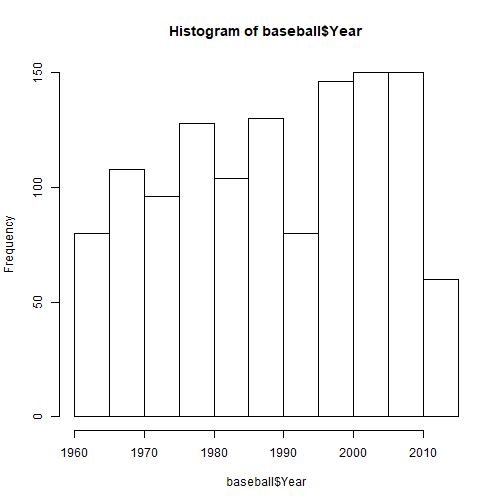
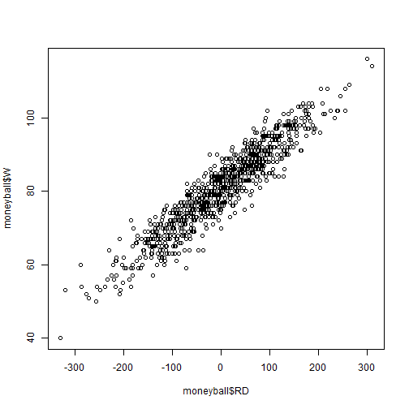

Exemplo - MoneyBall
========================================================
Este exemplo usa dados relacionados ao filme "Moneyball" para apresentar a técnica de regressão linear com o R.
Este exercício e a ideia de usar o exemplo do Moneyball é baseda em uma aula do MIT, da plataforma Edx: https://courses.edx.org/courses/course-v1:MITx+15.071x_3+1T2016/


```r
library(knitr)
```

Lendo Dados em CSV com read.csv()
========================================================
Normalmente lemos dados no formato .csv no R para realizar as análises. É possível também ler dados em outros formatos.


```r
# Definindo o Working Directory (pasta base na qual estaremos trabalhando).
# Esta função mostra as variáveis que temos, seus tipos e seus 
setwd("D:/DADOS/dev/sigepro-moneyball/moneyball")
```

```
## Error in setwd("D:/DADOS/dev/sigepro-moneyball/moneyball"): cannot change working directory
```

```r
# Lendo Dados em CSV
baseball = read.csv("baseball.csv")
```

Conhecendo os Dados com str()
========================================================
Antes de rodar qualquer análise precisamos conhecer a estrutura dos dados.


```r
# Podemos fazer isso usando a função str() (que mostra a estrutura)
str(baseball)
```

```
## 'data.frame':	1232 obs. of  15 variables:
##  $ Team        : Factor w/ 39 levels "ANA","ARI","ATL",..: 2 3 4 5 7 8 9 10 11 12 ...
##  $ League      : Factor w/ 2 levels "AL","NL": 2 2 1 1 2 1 2 1 2 1 ...
##  $ Year        : int  2012 2012 2012 2012 2012 2012 2012 2012 2012 2012 ...
##  $ RS          : int  734 700 712 734 613 748 669 667 758 726 ...
##  $ RA          : int  688 600 705 806 759 676 588 845 890 670 ...
##  $ W           : int  81 94 93 69 61 85 97 68 64 88 ...
##  $ OBP         : num  0.328 0.32 0.311 0.315 0.302 0.318 0.315 0.324 0.33 0.335 ...
##  $ SLG         : num  0.418 0.389 0.417 0.415 0.378 0.422 0.411 0.381 0.436 0.422 ...
##  $ BA          : num  0.259 0.247 0.247 0.26 0.24 0.255 0.251 0.251 0.274 0.268 ...
##  $ Playoffs    : int  0 1 1 0 0 0 1 0 0 1 ...
##  $ RankSeason  : int  NA 4 5 NA NA NA 2 NA NA 6 ...
##  $ RankPlayoffs: int  NA 5 4 NA NA NA 4 NA NA 2 ...
##  $ G           : int  162 162 162 162 162 162 162 162 162 162 ...
##  $ OOBP        : num  0.317 0.306 0.315 0.331 0.335 0.319 0.305 0.336 0.357 0.314 ...
##  $ OSLG        : num  0.415 0.378 0.403 0.428 0.424 0.405 0.39 0.43 0.47 0.402 ...
```

Definições de Variáveis
========================================================
Antes de rodar qualquer análise precisamos conhecer a estrutura dos dados.


```r
## TODO
```

O retnorno da função nos diz que esta variável "baseball" é um DataFrame. Um Dataframe é um tipo de variável no R que pode armazenar diversos tipos de dados (Números, texto, etc), que podemos usar no R.
Resumindo com o summary()
========================================================
Também podemos ter uma ideia dos dados usando o summary. Ele nos retorna médias, quartis, valores mínimos e máximos.


```r
# 
summary(baseball)
```

```
##       Team     League        Year            RS               RA        
##  BAL    : 47   AL:616   Min.   :1962   Min.   : 463.0   Min.   : 472.0  
##  BOS    : 47   NL:616   1st Qu.:1977   1st Qu.: 652.0   1st Qu.: 649.8  
##  CHC    : 47            Median :1989   Median : 711.0   Median : 709.0  
##  CHW    : 47            Mean   :1989   Mean   : 715.1   Mean   : 715.1  
##  CIN    : 47            3rd Qu.:2002   3rd Qu.: 775.0   3rd Qu.: 774.2  
##  CLE    : 47            Max.   :2012   Max.   :1009.0   Max.   :1103.0  
##  (Other):950                                                            
##        W              OBP              SLG               BA        
##  Min.   : 40.0   Min.   :0.2770   Min.   :0.3010   Min.   :0.2140  
##  1st Qu.: 73.0   1st Qu.:0.3170   1st Qu.:0.3750   1st Qu.:0.2510  
##  Median : 81.0   Median :0.3260   Median :0.3960   Median :0.2600  
##  Mean   : 80.9   Mean   :0.3263   Mean   :0.3973   Mean   :0.2593  
##  3rd Qu.: 89.0   3rd Qu.:0.3370   3rd Qu.:0.4210   3rd Qu.:0.2680  
##  Max.   :116.0   Max.   :0.3730   Max.   :0.4910   Max.   :0.2940  
##                                                                    
##     Playoffs        RankSeason     RankPlayoffs         G        
##  Min.   :0.0000   Min.   :1.000   Min.   :1.000   Min.   :158.0  
##  1st Qu.:0.0000   1st Qu.:2.000   1st Qu.:2.000   1st Qu.:162.0  
##  Median :0.0000   Median :3.000   Median :3.000   Median :162.0  
##  Mean   :0.1981   Mean   :3.123   Mean   :2.717   Mean   :161.9  
##  3rd Qu.:0.0000   3rd Qu.:4.000   3rd Qu.:4.000   3rd Qu.:162.0  
##  Max.   :1.0000   Max.   :8.000   Max.   :5.000   Max.   :165.0  
##                   NA's   :988     NA's   :988                    
##       OOBP             OSLG       
##  Min.   :0.2940   Min.   :0.3460  
##  1st Qu.:0.3210   1st Qu.:0.4010  
##  Median :0.3310   Median :0.4190  
##  Mean   :0.3323   Mean   :0.4197  
##  3rd Qu.:0.3430   3rd Qu.:0.4380  
##  Max.   :0.3840   Max.   :0.4990  
##  NA's   :812      NA's   :812
```

Acessando variáveis específicas de um DataFrame
========================================================
Podemos acessar variáveis específicas de um Data Frame usando algumas notações possíveis
Selecionando a coluna Ano

```r
baseball$Year
```

```
##    [1] 2012 2012 2012 2012 2012 2012 2012 2012 2012 2012 2012 2012 2012
##   [14] 2012 2012 2012 2012 2012 2012 2012 2012 2012 2012 2012 2012 2012
##   [27] 2012 2012 2012 2012 2011 2011 2011 2011 2011 2011 2011 2011 2011
##   [40] 2011 2011 2011 2011 2011 2011 2011 2011 2011 2011 2011 2011 2011
##   [53] 2011 2011 2011 2011 2011 2011 2011 2011 2010 2010 2010 2010 2010
##   [66] 2010 2010 2010 2010 2010 2010 2010 2010 2010 2010 2010 2010 2010
##   [79] 2010 2010 2010 2010 2010 2010 2010 2010 2010 2010 2010 2010 2009
##   [92] 2009 2009 2009 2009 2009 2009 2009 2009 2009 2009 2009 2009 2009
##  [105] 2009 2009 2009 2009 2009 2009 2009 2009 2009 2009 2009 2009 2009
##  [118] 2009 2009 2009 2008 2008 2008 2008 2008 2008 2008 2008 2008 2008
##  [131] 2008 2008 2008 2008 2008 2008 2008 2008 2008 2008 2008 2008 2008
##  [144] 2008 2008 2008 2008 2008 2008 2008 2007 2007 2007 2007 2007 2007
##  [157] 2007 2007 2007 2007 2007 2007 2007 2007 2007 2007 2007 2007 2007
##  [170] 2007 2007 2007 2007 2007 2007 2007 2007 2007 2007 2007 2006 2006
##  [183] 2006 2006 2006 2006 2006 2006 2006 2006 2006 2006 2006 2006 2006
##  [196] 2006 2006 2006 2006 2006 2006 2006 2006 2006 2006 2006 2006 2006
##  [209] 2006 2006 2005 2005 2005 2005 2005 2005 2005 2005 2005 2005 2005
##  [222] 2005 2005 2005 2005 2005 2005 2005 2005 2005 2005 2005 2005 2005
##  [235] 2005 2005 2005 2005 2005 2005 2004 2004 2004 2004 2004 2004 2004
##  [248] 2004 2004 2004 2004 2004 2004 2004 2004 2004 2004 2004 2004 2004
##  [261] 2004 2004 2004 2004 2004 2004 2004 2004 2004 2004 2003 2003 2003
##  [274] 2003 2003 2003 2003 2003 2003 2003 2003 2003 2003 2003 2003 2003
##  [287] 2003 2003 2003 2003 2003 2003 2003 2003 2003 2003 2003 2003 2003
##  [300] 2003 2002 2002 2002 2002 2002 2002 2002 2002 2002 2002 2002 2002
##  [313] 2002 2002 2002 2002 2002 2002 2002 2002 2002 2002 2002 2002 2002
##  [326] 2002 2002 2002 2002 2002 2001 2001 2001 2001 2001 2001 2001 2001
##  [339] 2001 2001 2001 2001 2001 2001 2001 2001 2001 2001 2001 2001 2001
##  [352] 2001 2001 2001 2001 2001 2001 2001 2001 2001 2000 2000 2000 2000
##  [365] 2000 2000 2000 2000 2000 2000 2000 2000 2000 2000 2000 2000 2000
##  [378] 2000 2000 2000 2000 2000 2000 2000 2000 2000 2000 2000 2000 2000
##  [391] 1999 1999 1999 1999 1999 1999 1999 1999 1999 1999 1999 1999 1999
##  [404] 1999 1999 1999 1999 1999 1999 1999 1999 1999 1999 1999 1999 1999
##  [417] 1999 1999 1999 1999 1998 1998 1998 1998 1998 1998 1998 1998 1998
##  [430] 1998 1998 1998 1998 1998 1998 1998 1998 1998 1998 1998 1998 1998
##  [443] 1998 1998 1998 1998 1998 1998 1998 1998 1997 1997 1997 1997 1997
##  [456] 1997 1997 1997 1997 1997 1997 1997 1997 1997 1997 1997 1997 1997
##  [469] 1997 1997 1997 1997 1997 1997 1997 1997 1997 1997 1996 1996 1996
##  [482] 1996 1996 1996 1996 1996 1996 1996 1996 1996 1996 1996 1996 1996
##  [495] 1996 1996 1996 1996 1996 1996 1996 1996 1996 1996 1996 1996 1993
##  [508] 1993 1993 1993 1993 1993 1993 1993 1993 1993 1993 1993 1993 1993
##  [521] 1993 1993 1993 1993 1993 1993 1993 1993 1993 1993 1993 1993 1993
##  [534] 1993 1992 1992 1992 1992 1992 1992 1992 1992 1992 1992 1992 1992
##  [547] 1992 1992 1992 1992 1992 1992 1992 1992 1992 1992 1992 1992 1992
##  [560] 1992 1991 1991 1991 1991 1991 1991 1991 1991 1991 1991 1991 1991
##  [573] 1991 1991 1991 1991 1991 1991 1991 1991 1991 1991 1991 1991 1991
##  [586] 1991 1990 1990 1990 1990 1990 1990 1990 1990 1990 1990 1990 1990
##  [599] 1990 1990 1990 1990 1990 1990 1990 1990 1990 1990 1990 1990 1990
##  [612] 1990 1989 1989 1989 1989 1989 1989 1989 1989 1989 1989 1989 1989
##  [625] 1989 1989 1989 1989 1989 1989 1989 1989 1989 1989 1989 1989 1989
##  [638] 1989 1988 1988 1988 1988 1988 1988 1988 1988 1988 1988 1988 1988
##  [651] 1988 1988 1988 1988 1988 1988 1988 1988 1988 1988 1988 1988 1988
##  [664] 1988 1987 1987 1987 1987 1987 1987 1987 1987 1987 1987 1987 1987
##  [677] 1987 1987 1987 1987 1987 1987 1987 1987 1987 1987 1987 1987 1987
##  [690] 1987 1986 1986 1986 1986 1986 1986 1986 1986 1986 1986 1986 1986
##  [703] 1986 1986 1986 1986 1986 1986 1986 1986 1986 1986 1986 1986 1986
##  [716] 1986 1985 1985 1985 1985 1985 1985 1985 1985 1985 1985 1985 1985
##  [729] 1985 1985 1985 1985 1985 1985 1985 1985 1985 1985 1985 1985 1985
##  [742] 1985 1984 1984 1984 1984 1984 1984 1984 1984 1984 1984 1984 1984
##  [755] 1984 1984 1984 1984 1984 1984 1984 1984 1984 1984 1984 1984 1984
##  [768] 1984 1983 1983 1983 1983 1983 1983 1983 1983 1983 1983 1983 1983
##  [781] 1983 1983 1983 1983 1983 1983 1983 1983 1983 1983 1983 1983 1983
##  [794] 1983 1982 1982 1982 1982 1982 1982 1982 1982 1982 1982 1982 1982
##  [807] 1982 1982 1982 1982 1982 1982 1982 1982 1982 1982 1982 1982 1982
##  [820] 1982 1980 1980 1980 1980 1980 1980 1980 1980 1980 1980 1980 1980
##  [833] 1980 1980 1980 1980 1980 1980 1980 1980 1980 1980 1980 1980 1980
##  [846] 1980 1979 1979 1979 1979 1979 1979 1979 1979 1979 1979 1979 1979
##  [859] 1979 1979 1979 1979 1979 1979 1979 1979 1979 1979 1979 1979 1979
##  [872] 1979 1978 1978 1978 1978 1978 1978 1978 1978 1978 1978 1978 1978
##  [885] 1978 1978 1978 1978 1978 1978 1978 1978 1978 1978 1978 1978 1978
##  [898] 1978 1977 1977 1977 1977 1977 1977 1977 1977 1977 1977 1977 1977
##  [911] 1977 1977 1977 1977 1977 1977 1977 1977 1977 1977 1977 1977 1977
##  [924] 1977 1976 1976 1976 1976 1976 1976 1976 1976 1976 1976 1976 1976
##  [937] 1976 1976 1976 1976 1976 1976 1976 1976 1976 1976 1976 1976 1975
##  [950] 1975 1975 1975 1975 1975 1975 1975 1975 1975 1975 1975 1975 1975
##  [963] 1975 1975 1975 1975 1975 1975 1975 1975 1975 1975 1974 1974 1974
##  [976] 1974 1974 1974 1974 1974 1974 1974 1974 1974 1974 1974 1974 1974
##  [989] 1974 1974 1974 1974 1974 1974 1974 1974 1973 1973 1973 1973
##  [ reached getOption("max.print") -- omitted 232 entries ]
```

De que anos estamos falando?


```r
hist(baseball$Year)
```



Acessando variáveis específicas de um DataFrame
========================================================
Podemos acessar variáveis específicas de um Data Frame usando algumas notações possíveis


```r
# Subset to only include moneyball years
moneyball = subset(baseball, Year < 2002)
str(moneyball)
```

```
## 'data.frame':	902 obs. of  15 variables:
##  $ Team        : Factor w/ 39 levels "ANA","ARI","ATL",..: 1 2 3 4 5 7 8 9 10 11 ...
##  $ League      : Factor w/ 2 levels "AL","NL": 1 2 2 1 1 2 1 2 1 2 ...
##  $ Year        : int  2001 2001 2001 2001 2001 2001 2001 2001 2001 2001 ...
##  $ RS          : int  691 818 729 687 772 777 798 735 897 923 ...
##  $ RA          : int  730 677 643 829 745 701 795 850 821 906 ...
##  $ W           : int  75 92 88 63 82 88 83 66 91 73 ...
##  $ OBP         : num  0.327 0.341 0.324 0.319 0.334 0.336 0.334 0.324 0.35 0.354 ...
##  $ SLG         : num  0.405 0.442 0.412 0.38 0.439 0.43 0.451 0.419 0.458 0.483 ...
##  $ BA          : num  0.261 0.267 0.26 0.248 0.266 0.261 0.268 0.262 0.278 0.292 ...
##  $ Playoffs    : int  0 1 1 0 0 0 0 0 1 0 ...
##  $ RankSeason  : int  NA 5 7 NA NA NA NA NA 6 NA ...
##  $ RankPlayoffs: int  NA 1 3 NA NA NA NA NA 4 NA ...
##  $ G           : int  162 162 162 162 161 162 162 162 162 162 ...
##  $ OOBP        : num  0.331 0.311 0.314 0.337 0.329 0.321 0.334 0.341 0.341 0.35 ...
##  $ OSLG        : num  0.412 0.404 0.384 0.439 0.393 0.398 0.427 0.455 0.417 0.48 ...
```

```r
# Compute Run Difference
moneyball$RD = moneyball$RS - moneyball$RA
str(moneyball)
```

```
## 'data.frame':	902 obs. of  16 variables:
##  $ Team        : Factor w/ 39 levels "ANA","ARI","ATL",..: 1 2 3 4 5 7 8 9 10 11 ...
##  $ League      : Factor w/ 2 levels "AL","NL": 1 2 2 1 1 2 1 2 1 2 ...
##  $ Year        : int  2001 2001 2001 2001 2001 2001 2001 2001 2001 2001 ...
##  $ RS          : int  691 818 729 687 772 777 798 735 897 923 ...
##  $ RA          : int  730 677 643 829 745 701 795 850 821 906 ...
##  $ W           : int  75 92 88 63 82 88 83 66 91 73 ...
##  $ OBP         : num  0.327 0.341 0.324 0.319 0.334 0.336 0.334 0.324 0.35 0.354 ...
##  $ SLG         : num  0.405 0.442 0.412 0.38 0.439 0.43 0.451 0.419 0.458 0.483 ...
##  $ BA          : num  0.261 0.267 0.26 0.248 0.266 0.261 0.268 0.262 0.278 0.292 ...
##  $ Playoffs    : int  0 1 1 0 0 0 0 0 1 0 ...
##  $ RankSeason  : int  NA 5 7 NA NA NA NA NA 6 NA ...
##  $ RankPlayoffs: int  NA 1 3 NA NA NA NA NA 4 NA ...
##  $ G           : int  162 162 162 162 161 162 162 162 162 162 ...
##  $ OOBP        : num  0.331 0.311 0.314 0.337 0.329 0.321 0.334 0.341 0.341 0.35 ...
##  $ OSLG        : num  0.412 0.404 0.384 0.439 0.393 0.398 0.427 0.455 0.417 0.48 ...
##  $ RD          : int  -39 141 86 -142 27 76 3 -115 76 17 ...
```

```r
# Scatterplot to check for linear relationship
plot(moneyball$RD, moneyball$W)
```



```r
# Regression model to predict wins
WinsReg = lm(W ~ RD, data=moneyball)
summary(WinsReg)
```

```
## 
## Call:
## lm(formula = W ~ RD, data = moneyball)
## 
## Residuals:
##      Min       1Q   Median       3Q      Max 
## -14.2662  -2.6509   0.1234   2.9364  11.6570 
## 
## Coefficients:
##              Estimate Std. Error t value Pr(>|t|)    
## (Intercept) 80.881375   0.131157  616.67   <2e-16 ***
## RD           0.105766   0.001297   81.55   <2e-16 ***
## ---
## Signif. codes:  0 '***' 0.001 '**' 0.01 '*' 0.05 '.' 0.1 ' ' 1
## 
## Residual standard error: 3.939 on 900 degrees of freedom
## Multiple R-squared:  0.8808,	Adjusted R-squared:  0.8807 
## F-statistic:  6651 on 1 and 900 DF,  p-value: < 2.2e-16
```

```r
# VIDEO 3

str(moneyball)
```

```
## 'data.frame':	902 obs. of  16 variables:
##  $ Team        : Factor w/ 39 levels "ANA","ARI","ATL",..: 1 2 3 4 5 7 8 9 10 11 ...
##  $ League      : Factor w/ 2 levels "AL","NL": 1 2 2 1 1 2 1 2 1 2 ...
##  $ Year        : int  2001 2001 2001 2001 2001 2001 2001 2001 2001 2001 ...
##  $ RS          : int  691 818 729 687 772 777 798 735 897 923 ...
##  $ RA          : int  730 677 643 829 745 701 795 850 821 906 ...
##  $ W           : int  75 92 88 63 82 88 83 66 91 73 ...
##  $ OBP         : num  0.327 0.341 0.324 0.319 0.334 0.336 0.334 0.324 0.35 0.354 ...
##  $ SLG         : num  0.405 0.442 0.412 0.38 0.439 0.43 0.451 0.419 0.458 0.483 ...
##  $ BA          : num  0.261 0.267 0.26 0.248 0.266 0.261 0.268 0.262 0.278 0.292 ...
##  $ Playoffs    : int  0 1 1 0 0 0 0 0 1 0 ...
##  $ RankSeason  : int  NA 5 7 NA NA NA NA NA 6 NA ...
##  $ RankPlayoffs: int  NA 1 3 NA NA NA NA NA 4 NA ...
##  $ G           : int  162 162 162 162 161 162 162 162 162 162 ...
##  $ OOBP        : num  0.331 0.311 0.314 0.337 0.329 0.321 0.334 0.341 0.341 0.35 ...
##  $ OSLG        : num  0.412 0.404 0.384 0.439 0.393 0.398 0.427 0.455 0.417 0.48 ...
##  $ RD          : int  -39 141 86 -142 27 76 3 -115 76 17 ...
```

```r
# Regression model to predict runs scored
RunsReg = lm(RS ~ OBP + SLG + BA, data=moneyball)
summary(RunsReg)
```

```
## 
## Call:
## lm(formula = RS ~ OBP + SLG + BA, data = moneyball)
## 
## Residuals:
##     Min      1Q  Median      3Q     Max 
## -70.941 -17.247  -0.621  16.754  90.998 
## 
## Coefficients:
##             Estimate Std. Error t value Pr(>|t|)    
## (Intercept)  -788.46      19.70 -40.029  < 2e-16 ***
## OBP          2917.42     110.47  26.410  < 2e-16 ***
## SLG          1637.93      45.99  35.612  < 2e-16 ***
## BA           -368.97     130.58  -2.826  0.00482 ** 
## ---
## Signif. codes:  0 '***' 0.001 '**' 0.01 '*' 0.05 '.' 0.1 ' ' 1
## 
## Residual standard error: 24.69 on 898 degrees of freedom
## Multiple R-squared:  0.9302,	Adjusted R-squared:   0.93 
## F-statistic:  3989 on 3 and 898 DF,  p-value: < 2.2e-16
```

```r
RunsReg = lm(RS ~ OBP + SLG, data=moneyball)
summary(RunsReg)
```

```
## 
## Call:
## lm(formula = RS ~ OBP + SLG, data = moneyball)
## 
## Residuals:
##     Min      1Q  Median      3Q     Max 
## -70.838 -17.174  -1.108  16.770  90.036 
## 
## Coefficients:
##             Estimate Std. Error t value Pr(>|t|)    
## (Intercept)  -804.63      18.92  -42.53   <2e-16 ***
## OBP          2737.77      90.68   30.19   <2e-16 ***
## SLG          1584.91      42.16   37.60   <2e-16 ***
## ---
## Signif. codes:  0 '***' 0.001 '**' 0.01 '*' 0.05 '.' 0.1 ' ' 1
## 
## Residual standard error: 24.79 on 899 degrees of freedom
## Multiple R-squared:  0.9296,	Adjusted R-squared:  0.9294 
## F-statistic:  5934 on 2 and 899 DF,  p-value: < 2.2e-16
```

